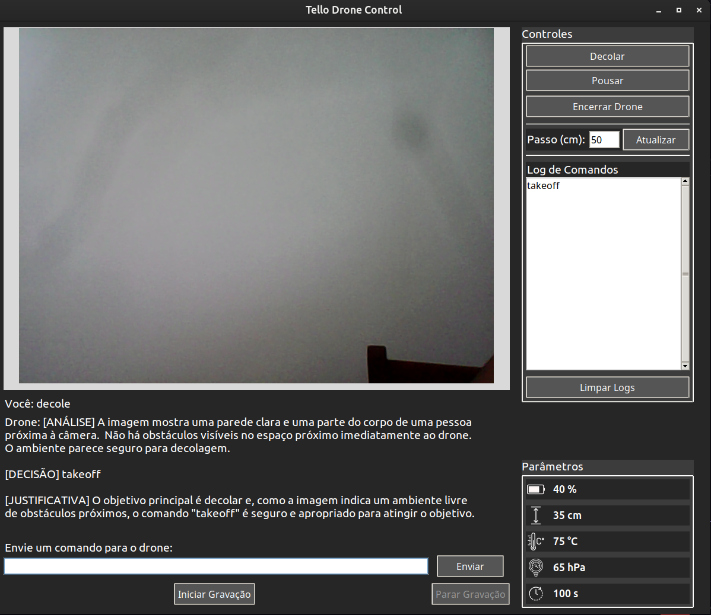

# **Controle Autônomo em Ambientes Fechados com Drones DJI Tello**  
## Participantes
- [Helton Maia](https://heltonmaia.com/) (professor)
- [Bruno Marques](https://sigaa.ufrn.br/sigaa/public/docente/portal.jsf?siape=1170845) (professor)
- Murilo de Lima Barros (aluno)

## **Descrição do Projeto**  
Este projeto desenvolve um sistema de logística autônoma em ambientes fechados utilizando drone DJI Tello equipado com câmera para identificar e navegar com instruções do usuário. Nossa solução busca otimizar tarefas de transporte de pequenos itens, monitoramento e inventário em escritórios, galpões e etc.

## **Funcionalidades de Chatbot e Controle**
- **Chatbot Integrado:** permite interação natural (texto) com o sistema via interface Streamlit. O usuário digita comandos livres, o chatbot interpreta e gera o comando DJI Tello correspondente.
- **Processamento de Comandos:** uso de `process_ai_command` para validar e enfileirar instruções recebidas do chatbot, com feedback em tempo real.
- **Interface Tkinter:** GUI para:
  - Visualizar vídeo ao vivo do drone
  - Enviar comandos via chatbot
  - Exibir parâmetros de voo (bateria, altura, pressão, temperatura, tempo e FPS)
  - Logs de comandos e chat

## **Principais Funcionalidades em Desenvolvimento**
- **Detecção de QR Codes:** OpenCV + PyZbar para leitura em tempo real.
- **Chatbot-AI:** interpretação de linguagem natural para comandos do drone (por ex. “siga”, “pouse quando chegar”, “voe 50 cm para frente”).

## **Ferramentas Utilizadas**
- **Hardware:** Drone DJI Tello
- **Software:** Python, OpenCV, PyTello SDK, PyZbar, Tkinter
- **IA & NLP:** Chatbot baseado em modelo de linguagem (Gemini)

## **Instalação**
```bash
# Clone o repositório
git clone https://github.com/heltonmaia/proj_drone_tello.git
cd proj_drone_tello
```
```bash
# Instale dependências
pip install -r requirements.txt
```

```bash
# Caso seja retornado erro requerendo uma biblioteca de áudio
sudo apt-get install portaudio19-dev
```

## **Uso**
1. **Conecte-se** à rede Wi‑Fi do drone DJI Tello.
2. **Execute** a interface:
   ```bash
   python3 -u main.py
   ```
3. **Na UI**:
   - Visualize o vídeo ao vivo.
   - Digite um comando manual ou conversacional na caixa de texto, ou grave um comando de voz com até 5 segundos.
   - Clique em "Enviar" ou pressione a tecla Enter na caixa de texto

## **Comandos Válidos via QR Code**
 O drone reconhece comandos via código QR, basta ele detectar o texto pela câmera.

| Comando         | Descrição                    |
|-----------------|------------------------------|
| `takeoff`       | Decolar                      |
| `land`          | Pousar                       |
| `up x`          | Subir x cm                   |
| `down x`        | Descer x cm                  |
| `right x`       | Mover-se à direita x cm      |
| `left x`        | Mover-se à esquerda x cm     |
| `forward x`     | Mover-se para frente x cm    |
| `back x`        | Mover-se para trás x cm      |
| `follow`        | Seguir                       |


## **Demonstração**
 Interface de usuário


 Controle via Chatbot

[Demonstração chatbot vídeo completo](https://youtu.be/vL5yCmnsLeQ)

 

 


